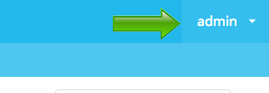
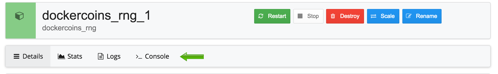

##Task 1: Installing Docker Universal Control Plane
In this task we're going to install the Docker Universal Control Plane (UCP) server onto **Node-0**. This is done by running a bootstrap container, and providing a few pieces of information. 

**Note***: Normally the isntaller would pull the installation images from Docker Hub or Docker Trusted Registry (DTR), for this lab, we've prestaged the images onto your machine so you won't need to login to either Docker Hub or DTR*

**Note***: Some dialogs / logs will say "Orca" this was the interal code name for UCP*

1. SSH into **Node-0**

		$ ssh ubuntu@<node-0 public ip>
	
 	**Note***: You may be promted to accept the RSA key. If so, enter* `yes`
 	
 	**Note***: The default password is* `D0ckerconEU!`

2. Run the UCP bootstrap with the install option

		docker run --rm -it \
		-v /var/run/docker.sock:/var/run/docker.sock \ 
		--name orca-bootstrap \
		dockerorca/orca-bootstrap \
		install -i
		
3. Provide the following inputs:

	- Password: `D0ckerconEU!`
	- Additional Aliases: `<Node-0 Public DNS>` `<Node-0 IP>`
	 
	  **Note***: Do not use the private IP. Use the one labled "IP"*

	The UCP installer should finish something similar to:
	
		INFO[0160] Installing Orca with host address 172.31.42.38
		INFO[0002] Generating Swarm Root CA
		INFO[0013] Generating Orca Root CA
		INFO[0022] Deploying Orca Containers
		INFO[0027] Orca instance ID: JJOB:SQP3:PERQ:UPP3:54UP:K7B6:ZWL6:GLES:CN7M:5KLO
		INFO[0027] Orca Server SSL: SHA1 Fingerprint=48:22:4F:6B:36:6D:
		INFO[0027] Login as "admin"/(your admin password) to Orca at https://<node-0 private IP>:443

4. Open your web browser, and naviate to `https://<node-0 IP>`.

	**Note***: Use* `https` *not* `http`

	Username: admin
	
	Password: D0ckerconEU!
	
	You'll be logged into the UCP dashboard. Notice you have 7 containers, 7 images, 1 node, and 0 applications running. These images and containers are what power the UCP server.
	
##Task 2: Deploy a Second Docker Host (NOT FINISHED)
One of UCP's capabilities is that it acts as a web-based front-end to Swarm. In this step we'll add a 2nd node (**Node-1**) to for UCP to manage (which is the same as adding a second node to a Swarm cluster). 

1. In a new terminal session SSH into **Node-1**

		$ ssh ubuntu@<node-1 public ip>
	
 	**Note***: You may be promted to accept the RSA key. If so, enter* `yes`
 	
 	**Note***: The default password is* `D0ckerconEU!`

2. Run the UCP bootstrap with the join option

		docker run --rm -it \
		-v /var/run/docker.sock:/var/run/docker.sock \ 
		--name orca-bootstrap \
		dockerorca/orca-bootstrap \
		join -i

3. Provide the following inputs:

	- URL to the Orca server: `https://<node-0 IP>`
	- Proceed with the join: `y`
	- Admin username: `admin`
	- Admin password: `D0ckerconEU!`
	- Additional Aliases: `<Node-1 Public DNS>` `<Node-1 IP>`

#(Not Finished)

##Task 3: Create a Container
In this section we'll deploy an Nginx container using UCP

1. In your web browser navigate to the UCP server via Node-0's public DNS

	For example: `https://ec2-52-33-49.us-west-2.compute.amazonaws.com`
	
	**Note***: You will be warned that your connection is not private. That is because we are not using publicly signed certificates for the SSL connnection to the website.*
	
	*To by pass this click `advanced` and then `proceed to . . . .` link*
	
2. Login into the UCP server with the username `admin` (case sensitive) and the password `D0ckerconEU!`

3. In the UCP UI click the menu button in the upper left corner

	

4. From the drop down select `Containers`

5. On the Orca / Networks page, click `+ Deploy Container`
	
6. Provide the following inputs:

	- Image Name: `nginx:latest`	
	- Container Name: `mynginx`
	- Under Network set port 80 to redirect to 8005 and click the `+` button

	
	
	Feel free to examine the other settings, but leave them at their defaults
	
5. Click `Run Container`

	
	
6. In your web browser navigate to `http://<node-0 public ip>:8005` and you should see the Nginx welcome screen.
	
## Task 4: Using UCP from the Command Line
One of the great things about UCP is that it doesn't preclude you from using the Docker command line tools you're used to. In this task we're going to install the UCP client bundle into an Ubuntu host in AWS.

1. Click the drop down menu in the upper right corner of the UCP screen

	
	
2. Select `Client Bundle` from the drop down. This will download a .zip file with the certs necessary to connect to the UCP server, as well as a script file to set the appropriate environment variables. 

3. Open a command / terminal window on your laptop and create a directory on your local machine, copy the downloaded file into that directory and unzip it

	**Note***: Below is an example from a Macbook, it will be different for Windows users, and may be differnt or other users on a Macbook depending on configurations. If you need assistance ask a lab volunteer*

		~ $ mkdir UCP
		~ $ cd UCP
		UCP $ mv ~/Downloads/orca-bundle-admin.zip .
		UCP $ unzip orca-bundle-admin.zip
		Archive:  orca-bundle-admin.zip
 		extracting: ca.pem
 		extracting: cert.pem
 		extracting: key.pem
 		extracting: cert.pub
 		extracting: env.sh
 
4. SCP the directory with the UCP client files up to the home directory on **Node-2**

 		$ scp -r ~/UCP ubuntu@<node-2 public ip>:~/
 		
 		ca.pem                              100% 3652     3.6KB/s   00:00
		cert.pem                            100% 1655     1.6KB/s   00:00
		cert.pub                            100%  450     0.4KB/s   00:00
		env.sh                              100%  499     0.5KB/s   00:00
		key.pem                             100% 1679     1.6KB/s   00:00
		orca-bundle-admin.zip               100% 8487     8.3KB/s   00:00
		
   **Note***: You may be promted to accept the RSA key. If so, enter* `yes`
       
   **Note***: The default password is* `D0ckerconEU!`
	
5. SSH into **Node-2**

		$ ssh ubuntu@<node-2 public IP>
		
   **Note***: You may be promted to accept the RSA key. If so, enter* `yes`
 	
 	**Note***: The default password is* `D0ckerconEU!`
 	
6. Change into the directory containing our client files

		$ cd UCP
		
7. Execute the `env.sh` script to set the appropriate environment variables for your UCP deployment

		$ source env.sh
		
8. Because AWS has both a private and public network, we need to reset the DOCKER_HOST environment variable to point to the private IP address of **Node-0** (our UCP server)

		$ eval DOCKER_HOST=tcp://<node-0 private IP>:2376
		
9. Run `docker info` to examine the configuration of your Docker Swarm

		$ docker info
		Containers: 7
		Images: 8
		Role: primary
		Strategy: spread
		Filters: health, port, dependency, affinity, constraint
		Nodes: 1
		 ip-172-31-42-38: 172.31.42.38:12376
		  └ Containers: 7
		  └ Reserved CPUs: 0 / 2
		  └ Reserved Memory: 0 B / 8.186 GiB
		  └ Labels: executiondriver=native-0.2, kernelversion=3.19.0-26-generic, operatingsystem=Ubuntu 14.04.3 LTS, storagedriver=aufs
		CPUs: 2
		Total Memory: 8.186 GiB
		Name: ip-172-31-42-38
		ID: 3QZI:W6AC:GKGQ:WEF2:UEYQ:TEKQ:DRRU:OLNA:Q7R2:5JSZ:ZA77:5JYX
		Labels:
			 swarm_master=tcp://172.31.42.38:2376
			 
##Task 5: Use Docker Compose 
In this task we'll use Docker Compose to stand up a multi-tier application on our Swarm. 

1. Make sure you're SSH'd into **Node-2**

2. Change into your home directory

	$ cd ~/

2. Clone the repo for our example application (Bonus points if you fork vs. clone)

		$ git clone http://github.com/mikegcoleman/dockercoins.git
		Cloning into 'dockercoins'...
		remote: Counting objects: 26, done.
		remote: Total 26 (delta 0), reused 0 (delta 0), pack-reused 26
		Unpacking objects: 100% (26/26), done.
		Checking connectivity... done.
		
3. Change into the directory that houses our compose file

		$ cd dockercoins
		
4. Standup the application. The compose file will stand up 5 different containers that comprise an app that mines dockercoins (a fake currency to buy fake goods in a fake marketplace).

		$ docker-compose up -d
		
	It will take a couple minutes for the compose to complete, and several lines of text 	will scroll by. It should finish similar to this

		Removing intermediate container 719c1c71f6ef
		Step 4 : COPY files/ /files/
		 ---> 0206cb94146c
		Removing intermediate container 583bdadb692d
		Step 5 : COPY webui.js /
		 ---> 36a00e5ea6cb
		Removing intermediate container 7a00097dcf3e
		Step 6 : CMD node webui.js
		 ---> Running in 12a4ce9c7612
		 ---> 97dfeab680fb
		Removing intermediate container 12a4ce9c7612
		Successfully built 97dfeab680fb
		Creating dockercoins_webui_1

5. In your web browser, open a new tab and navigate to `http://<node-0 public IP>:8000/` to see your app running 

	**Note***: Be sure to use HTTP not HTTPS*
		
5. In your web browser navigate back to the UCP server (`https://<node-0 public IP>`)

	Notice the dashboard now shows 1 application running. 
	
6. Click on the menu icon and select `applications` from the drop down. 

	
	
7. List out all the running containers by clicking `Show` on the line listing the Dockercoins application

	
	
	Notice that from here you control the container state (stop, restart, start) as well as 	delete a container. 

8. Click `inspect` next to the dockercoins_rng container

	This shows us the details of the running container. We can also control container state 	here. Aditionally we can scale out a given container. 
	
9. Click `Scale` and enter 5 as the number of instances. Then click `Scale` again. 

	

10. Notice how the menu bar allows you to see performance stats, logs, and even open a console window into the container. Feel free to explore these options. 

	
	
	

		

	

		
		
	
	
 

	